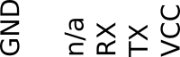

# triflight for iNav 4.2 by [@jihlein](https://github.com/jihlein/inav/tree/2p4p0tf0p5)

This is a special Branch for iNav that supports tri copters with a special servo that has a feedback wire (analog output of the potentiometer in the servo controller).

Build:
- 8" 'Tricopter LR V4' from Dvaid Windestal
- FC: KakuteF4V2
- PDB: Matek FCHUB-W
- SERVO: BMS-210DMH
- Motors: EMAX RSII-2207 1600KV
- ESC: BLHeli_S 16A


# Ressources
- [lkaino Triflight Setup instructions](https://github.com/lkaino/Triflight/blob/master/docs/Triflight%20Checklist.md)
- [known good configuration](https://www.rcgroups.com/forums/showpost.php?p=44425535&postcount=319) for iNav 2.4 triflight (2p4p0tf0p5)
- triflight iNav 2.4  [2p4p0tf0p5 diff](https://github.com/jihlein/inav/commit/73d5e5295a4e89da7aa6ed960f17e512d7855570) [2p4p0tf0p5 new files](https://github.com/jihlein/inav/commit/ca994a8c20a5305f06020bf433f342b4c4ca543e)
- [Older Development Discussion on rcexplorer.se](https://rcexplorer.se/forums/topic/inav-for-kakutef4v2-based-tricopters/)
- [Continued Discussion on RCGroups,com](https://www.rcgroups.com/forums/showthread.php?3523531-Triflight-with-INAV)
- [Impossible tail-servo tilt mechanism](https://www.thingiverse.com/thing:1035497)
- Servos: [Turnigy 210 Servo](https://hobbyking.com/en_us/turnigytm-tgy-210dmh-coreless-w-heat-sink-ds-mg-servo-3-9kg-0-13sec-16g.html?___store=en_us) / BMS-210DMH

# Firmware 2p4p0tf0p5 HEX Files
- [KAKUTEF4V2TRI](hex/2.4.0/trinav_2.4.0_KAKUTEF4V2TRI.hex)
- [KAKUTEF7](hex/2.4.0/trinav_2.4.0_KAKUTEF7.hex)
- [MATEKF405](hex/2.4.0/trinav_2.4.0_MATEKF405.hex)


## TriFlight Configuration Options

| name | min | max | default | unit |
| --- | ---: |  ---: |  ---: | --- |
| tri_dynamic_yaw_minthrottle | 0 | 500 | 100 |  |
| tri_dynamic_yaw_maxthrottle | 0 | 100 | 100 |  |
| tri_dynamic_yaw_hoverthrottle | 0 | 2000 | 0 |  |
| tri_motor_acc_yaw_correction | 0 | 200 | 6 |  |
| tri_motor_acceleration | 1 | 100 | 18 |  |
| tri_servo_angle_at_max | 0 | 400 | 400 |  |
| tri_servo_feedback |  |  | TRI_SERVO_FB_RSSI |  |
| tri_servo_max_adc | 0 | 65535 | 0 |  |
| tri_servo_mid_adc | 0 | 65535 | 0 |  |
| tri_servo_min_adc | 0 | 65535 | 0 |  |
| tri_tail_motor_thrustfactor | 10 | 400 | 138 |  |
| tri_tail_servo_speed | 0 | 1000 | 300 | deg/s |

# Output Mappings for 2p4p0tf0p5

## Output Mappings KAKUTEF4V2TRI

| Actuator | Pad | Comment | Direction |
| --- | --- | --- | --- |
| Motor 1 | M3 | pos: tail | CCW |
| Motor 2 | M2 | pos: front right | CCW |
| Motor 3 | M1 | pos: front left | CW |
| Tail Servo | LED | Only with branch 2p4p0tf0p5 | Reversed |
| Feedback | RSI | Servo feedback wire | n/a |

[Manual](docs/kakutef4v2.pdf)

## Output Mappings KAKUTEF7

| Actuator | Pad | Comment | Direction |
| --- | --- | --- | --- |
| Motor 1 | M3 | pos: tail | CCW |
| Motor 2 | M2 | pos: front right | CCW |
| Motor 3 | M1 | pos: front left | CW |
| Tail Servo | M5 |  | Reversed? |
| Feedback | RSI | Servo feedback wire | n/a |

[Manual](docs/Holybro_Kakute_F7_V1.5_Manual.pdf)

### 8 pin molex connector pinout

| Pin | Description |
| --- | --- |
| B+ | vBat / Battery |
| R7 | UART 7 RX
| G  | Ground
| I  | Current Sensor ? |
| M1 | Motor 1 |
| M2 | Motor 2 |
| M3 | Motor 3 |
| M4 | Motor 4 |

Orientation: USB Connector is next to M4


## Output Mappings Matek405*

| Actuator | Pad | Comment | Direction |
| --- | --- | --- | --- |
| Motor 1 | M2 | pos: tail | CCW |
| Motor 2 | M3 | pos: front right | CCW |
| Motor 3 | M4 | pos: front left | CW |
| Tail Servo | M1 |  | Reversed? |
| Feedback | RSI? | Servo feedback wire | n/a |


## Peripherals

### 3DR uBLOX GPS V1.2

#### GPS Port Layout



from front to back:

| pos | color | function |
| --- | --- | --- |
| 1 | red | VCC |
| 2 | blk | TX |
| 3 | blk | RX |
| 4 | blk | n/a |
| 5 | blk | NC |
| 6 | blk | GND |


#### Magnetormeter I2C Port

from front to back:

| pos | color | function |
| --- | --- | --- |
| 1 | red | VCC |
| 2 | blk | SCL |
| 3 | blk | SDA |
| 4 | blk | GND |


## Compile Firmware on Linux

### clone and check out branch

``` 
git clone git@github.com:jihlein/inav.git
cd inav
git checkout 2p4p0tf0p5
``` 

### Prerequesites according to "Buidling in Ubuntu.md"

``` 
sudo apt install gcc-arm-none-eabi
arm-none-eabi-gcc -dumpversion
7.3.1
``` 

### update compiler (inav 2.4 on debian)

``` 
make arm_sdk_install
``` 

### Build KAKUTEF4V2TRI

build with recent compiler, override compiler directory in tools.mk

``` 
make TARGET=KAKUTEF4V2TRI ARM_SDK_DIR=tools/gcc-arm-none-eabi-8-2018-q4-major
make TARGET=KAKUTEF7 ARM_SDK_DIR=tools/gcc-arm-none-eabi-8-2018-q4-major
make TARGET=MATEKF405 ARM_SDK_DIR=tools/gcc-arm-none-eabi-8-2018-q4-major
# NOTE: change path to compiler as needed
```

## Tailtune

	left	CW
	right	CCW
	tail	CCW


### 1. Tail servo bench tuning

Without the configurator. Zero throttle and not touching sticks. Connect battery. Do not arm.

1. Turn on tail tune mode
1. Push cyclic stick left, right or up shortly to select min, max or mid
1. Adjust with yaw stick (mid must be very accurate)
1. Turn off tail tune mode
1. Save values with stick command (both max down and out)
1. Remove battery

### 2. hardware servo feedback

Feedback signal is calibrated by 

1. Min, mid and max positions must be set before this (see "Tail servo bench tuning" above). 
1. pulling down on pitch stick while doing the Tail servo bench tuning. 
1. If you start this, all bench tuning values will be saved automatically (there is no way to cancel).

### 3. Accelerometer hover calibration

Double check your COG (center of gravity) first. It shall be on the centerline, one third from the front props to the aft prop.

On a calm day, hover in angle mode at least eyeheight. Look for sideways drift and then land.

When disarmed throttle max up, cyclic max to the side opposite to where it drifts. The board will be blinking and make a short beep (if you have a Buzzer) for every 0.1 degree of adjustment.

Adjust, arm, fly, disarm, repeat till it doesn’t start drifting.

### 4. Tail servo hover tuning

1. arm the copter before switching tail tune on
1. activate tailtune in air
1.  Let it hover and do not touch the sticks for about 30s. It's ok to use the sticks to adjust the hover position but for that time the tuning is paused.
1. Land and disarm, still having tail tune on
1. The ready beeping should continue every 2 seconds
1. The values are now automatically saved (if you disarm first, wait a few seconds and then deactivate the tail tune. Do not use stick command.)


## debugging

```set debug_mode=triflight```

The computed angle looks correct. You can observe this by looking at debug2 on the sensors tab, deselect all debug checkboxes except debug. After a successful ongound servo cal, it should indicate roughly 50 - 90 degrees when tilted to the left (tricopter facing forward, looking forward), and 90 - 130 when tilted to the right.


https://www.rcgroups.com/forums/showpost.php?p=44099143&postcount=263


## iNav 2.4 Triflight configuration for Tricopter LR

```
diff

# version
# INAV/KAKUTEF4V2TRI 2.4.0 May 26 2020 / 18:28:11 (10da960b2)
# GCC-8.2.1 20181213 (release) [gcc-8-branch revision 267074]

# start the command batch
batch start

# resources

# mixer
mmix 0  1.000  0.000  1.333  0.000
mmix 1  1.000 -1.000 -0.667  0.000
mmix 2  1.000  1.000 -0.667  0.000

# servo mix
smix 0 5 2 100 0 -1

# servo
servo 5 995 1892 1450 -100

# logic

# gf

# feature
feature VBAT
feature DYNAMIC_FILTERS
feature TRIFLIGHT
feature BLACKBOX
feature PWM_OUTPUT_ENABLE

# beeper

# map

# serial
serial 0 0 115200 115200 0 115200
serial 3 4096 115200 115200 0 115200

# led

# color

# mode_color

# aux
aux 0 0 2 900 1300
aux 1 1 0 1700 2100
aux 2 11 2 1300 1700
aux 3 42 1 900 1300

# adjrange

# rxrange

# temp_sensor

# wp
#wp 0 invalid

# osd_layout
osd_layout 0 2 0 0 V
osd_layout 0 9 1 2 H
osd_layout 0 32 12 1 V
osd_layout 0 33 1 1 V

# master
set looptime = 500
set gyro_hardware_lpf = 256HZ
set gyro_lpf_hz = 110
set gyro_lpf_type = PT1
set acc_hardware = MPU6500
set acczero_x = 23
set acczero_y = -17
set accgain_x = 4089
set accgain_y = 4093
set accgain_z = 4043
set mag_hardware = NONE
set baro_hardware = BMP280
set pitot_hardware = NONE
set rssi_channel = 12
set serialrx_provider = CRSF
set blackbox_device = SPIFLASH
set motor_pwm_rate = 8000
set motor_pwm_protocol = DSHOT300
set align_board_roll = 24
set align_board_pitch = 28
set platform_type = TRICOPTER
set model_preview_type = 1
set servo_pwm_rate = 330
set applied_defaults = 2
set mc_airmode_type = THROTTLE_THRESHOLD
set osd_crosshairs_style = AIRCRAFT
set i2c_speed = 800KHZ
set debug_mode = TRIFLIGHT
set name = Tricopter LR
set vtx_band = 5
set vtx_channel = 8
set vtx_freq = 5917
set tri_dynamic_yaw_hoverthrottle = 1346
set tri_servo_max_adc = 2869
set tri_servo_mid_adc = 1970
set tri_servo_min_adc = 1113
set tri_tail_motor_thrustfactor = 109
set tri_tail_servo_speed = 198

# profile
profile 1

set mc_p_pitch = 45
set mc_i_pitch = 50
set mc_d_pitch = 39
set mc_i_roll = 60
set mc_d_roll = 34
set mc_p_yaw = 180
set mc_i_yaw = 60
set mc_d_yaw = 3
set max_angle_inclination_rll = 600
set max_angle_inclination_pit = 600
set dterm_lpf_hz = 60
set dterm_lpf_type = PT1
set dterm_lpf2_hz = 170
set dterm_lpf2_type = PT1
set use_dterm_fir_filter = OFF
set yaw_lpf_hz = 30
set dterm_setpoint_weight =  0.750
set dterm_notch_hz = 162
set dterm_notch_cutoff = 120
set heading_hold_rate_limit = 45
set nav_mc_vel_xy_i = 14
set nav_mc_heading_p = 65
set d_boost_factor =  1.500
set antigravity_gain =  2.000
set antigravity_accelerator =  5.000
set tpa_rate = 20
set tpa_breakpoint = 1650
set rc_yaw_expo = 70
set roll_rate = 30
set pitch_rate = 30
set yaw_rate = 30

# battery_profile
battery_profile 1

set battery_capacity = 5000
set battery_capacity_warning = 2000
set battery_capacity_critical = 1500

# end the command batch
batch end

# 
```
